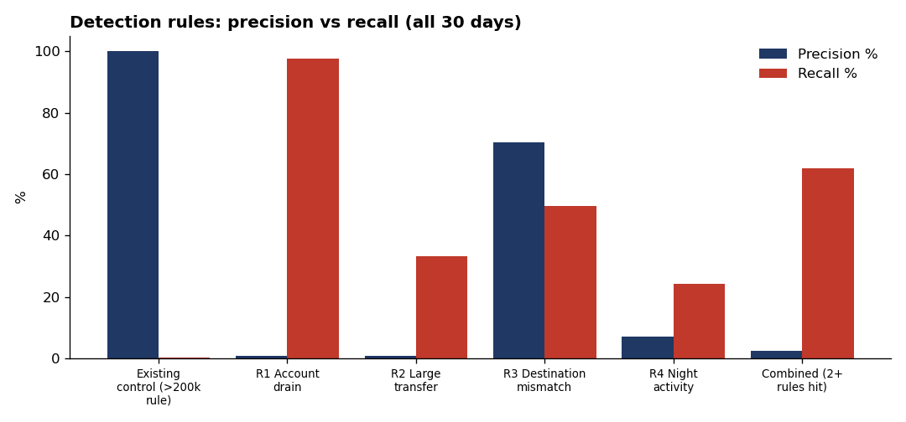
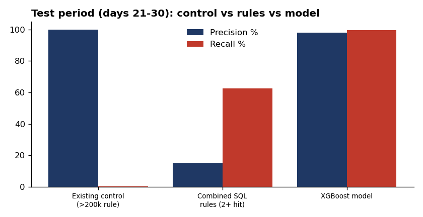
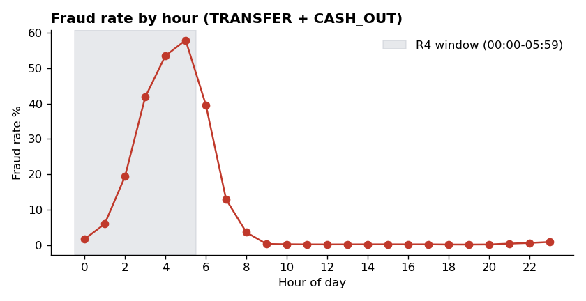

# Transaction Fraud & AML Monitoring

Rule-based and machine-learning detection of fraudulent transactions on 6.3M mobile-money transactions, built the way a bank's transaction-monitoring team works: define detection scenarios, measure every one, compare against a model, and hand investigators a prioritized alert queue.

**Tools:** SQL (DuckDB) · Python (pandas, XGBoost, scikit-learn) · Excel (openpyxl) · matplotlib



## Business problem

The existing control flags only transfers above 200,000. The question: **how much fraud does it miss, and can better rules or a model catch more without flooding analysts with false alerts?**

## Results

<!-- RESULTS_START -->
| Metric | Value |
|---|---|
| Transactions analyzed | 4,169,693 |
| Fraudulent transactions | 8,213 |
| Fraud amount | 12,056,415,428 |
| Existing control recall | 0.19% (16 of 8,213) |
| Best single rule | R1 Account drain: 97.67% recall, 0.68% precision |
| Combined rules (all 30 days) | 61.87% recall, 2.51% precision |
| XGBoost (test days 21-30) | 99.48% recall, 98.14% precision |
| XGBoost PR-AUC (test) | 0.999 |

### Rules vs model on the test period
| approach | alerts | true_positives | false_positives | missed_fraud | precision_pct | recall_pct |
|---|---|---|---|---|---|---|
| Existing control (>200k rule) | 10 | 10 | 0 | 2,854 | 100.00 | 0.35 |
| Combined SQL rules (2+ hit) | 11,983 | 1,794 | 10,189 | 1,070 | 14.97 | 62.64 |
| XGBoost model | 2,903 | 2,849 | 54 | 15 | 98.14 | 99.48 |
<!-- RESULTS_END -->



## Approach

1. **Load & profile (SQL):** loaded the CSV into DuckDB and profiled fraud by transaction type ([01_profile.sql](sql/01_profile.sql)); measured the existing control ([02_existing_control.sql](sql/02_existing_control.sql)).
2. **Detection rules (SQL):** four scenarios based on common fraud/AML typologies ([03_rules.sql](sql/03_rules.sql)):

   | Rule | Logic | Typology |
   |---|---|---|
   | R1 Account drain | TRANSFER/CASH_OUT that empties the sender's balance | Account takeover |
   | R2 Large transfer | TRANSFER over 200,000 | Threshold / structuring control |
   | R3 Destination mismatch | Money sent but receiver balance never moves | Funds routed out of the system |
   | R4 Night activity | TRANSFER/CASH_OUT between 00:00 and 05:59 | Off-hours anomaly |

3. **Rule measurement (SQL):** alerts, true/false positives, precision and recall for each rule and a combined "2+ rules hit" scenario ([04_rule_performance.sql](sql/04_rule_performance.sql)).
4. **Model (Python):** XGBoost classifier on TRANSFER and CASH_OUT transactions, **trained on days 1-20 and tested on days 21-30** so it's evaluated on future transactions, like a production model.
5. **Outputs:** an Excel report for investigators (`outputs/fraud_monitoring_report.xlsx`) with a risk-ranked alert queue, rule performance, and daily summary; charts in `images/`.



## Design decisions

- **Precision and recall, not accuracy.** Fraud is well under 1% of transactions, so a model that flags nothing is over 99% "accurate." Recall measures fraud caught; precision measures analyst workload wasted on false alerts.
- **Time-based split.** A random split would let the model learn from transactions that happen after the ones it's tested on.
- **Class weighting.** `scale_pos_weight` compensates for the extreme imbalance between fraud and non-fraud.
- **Balance-error features.** `err_orig` and `err_dest` measure money that should have moved according to the balances but didn't, the strongest signal in this data.

## Limitations

PaySim is **synthetic**. Its balance fields make fraud much easier to separate than in real bank data, so the model's scores here are far higher than a production system would achieve. Real monitoring would also use customer history, device and network data, and counterparty risk.

## How to run

```bash
# macOS: run `brew install libomp` once first (needed by XGBoost), and use pip3/python3
pip install -r requirements.txt
# download the data first: see data/README.md
python src/run_pipeline.py
```

Runtime: a few minutes on a normal laptop. Results appear in `outputs/`, charts in `images/`, and the Results section above updates automatically.

## Project structure

```text
├── data/README.md          # how to download the dataset
├── sql/                    # all SQL: profiling, rules, rule measurement
├── src/run_pipeline.py     # end-to-end pipeline
├── src/excel_utils.py      # Excel report formatting
├── outputs/                # CSV results + Excel monitoring report
└── images/                 # charts
```
